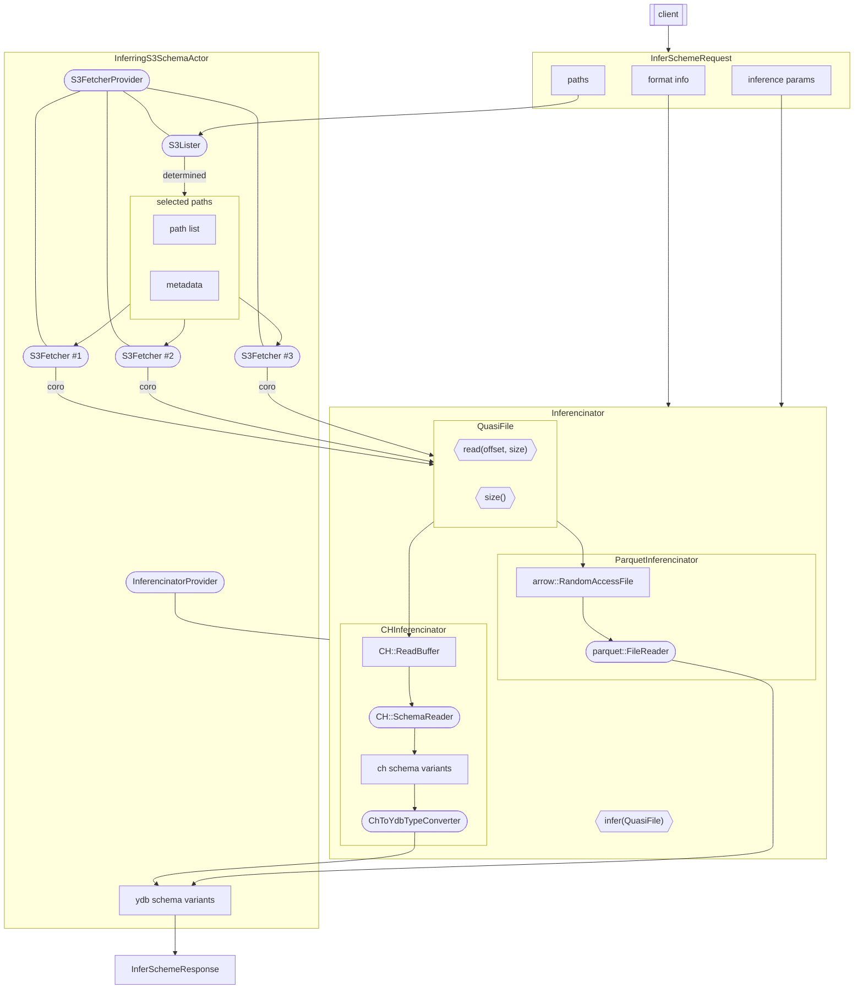

# Inferencinator design

## The Plan

```mermaid
flowchart
	cl[[client]]

    subgraph req [InferSchemeRequest]
        fmt[format info]
        paths
        ip[inference params]
    end

    subgraph fmt_inf [Inferencinator]
        infer_func{{"infer(QuasiFile)"}}

        subgraph q_file [QuasiFile]
            read{{"read(offset, size)"}}
            size{{"size()"}}
        end

        subgraph ch_inf [CHInferencinator]
            ch_schema_reader([CH::SchemaReader])

            rb[CH::ReadBuffer]
            ch_schema_vars[ch schema variants]
            ch_type_conv([ChToYdbTypeConverter])

            rb --> ch_schema_reader --> ch_schema_vars --> ch_type_conv
        end

        subgraph custom_inf [ParquetInferencinator]
            custom_schema_reader([parquet::FileReader])
            f_subst[arrow::RandomAccessFile]

            f_subst --> custom_schema_reader
        end
    end

    subgraph ia [InferringS3SchemaActor]
        sfp([S3FetcherProvider])
        s3_ls([S3Lister])
        sf1([S3Fetcher #1])
        sf2([S3Fetcher #2])
        sf3([S3Fetcher #3])

        sfp --- s3_ls & sf1 & sf2 & sf3

        subgraph sp [selected paths]
            pl[path list]
            md[metadata]
        end

        paths --> s3_ls -->|determined| sp

        inf_provider([InferencinatorProvider])

        ydb_schema_vars[ydb schema variants]
    end

    ch_type_conv & custom_schema_reader --> ydb_schema_vars
    inf_provider --- fmt_inf  --- ch_inf & custom_inf
    sf1 & sf2 & sf3 -->|coro| q_file --> rb & f_subst
    fmt & ip --> fmt_inf

    sp --> sf1 & sf2 & sf3
	cl --> req

    res[InferSchemeResponse]
    ydb_schema_vars --> res
```

### Side-note

`S3Lister` == `TS3FileQueue` ?

`S3Fetcher` == `TS3ReadCoroImpl` ?